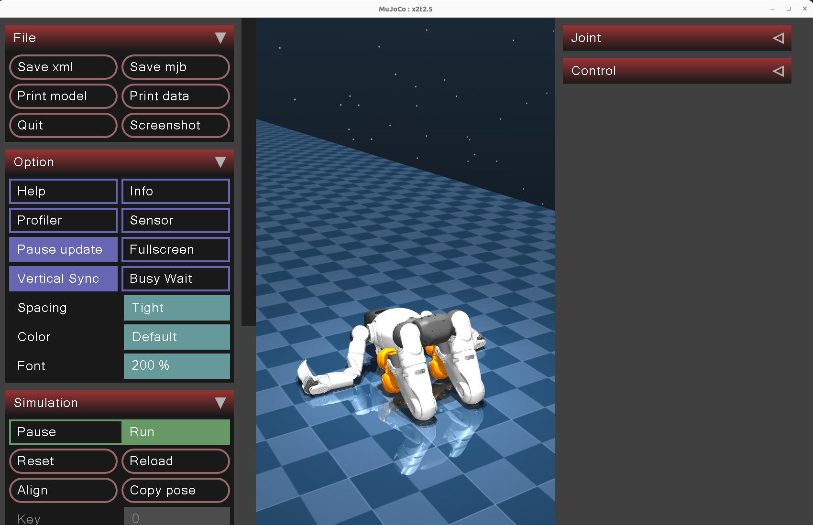

# RL_Deploy_aimdkv9
- [该仓库由此仓库适配灵犀X2机器人得到，原仓库链接由此去](https://github.com/Link-U-OS/rl_deploy.git)

- lx2501_3-v0.9.0.4来自灵犀官方文档

- Ubuntu 22.04LTS
  
- 第一次开始
    - 编译lxsdkv9
        
        ```
        cd lx2501_3-v0.9.0.4
        source /opt/ros/humble/setup.bash
        colcon build
        ```
        
        ```
        运行日志:
        ……………………………………此处省略大量内容……………………………………
        ---
        Finished <<< py_examples [0.71s]
        
        Summary: 4 packages finished [2.17s]
          1 package had stderr output: py_examples
        解读：
        	py_examples.data下只有一个rgb_head_rear_mask.png暂时用不到，该警告被暂时搁置
        
        ```
        
    - 创建虚拟环境 venv
        
        ```
        cd aimrl_sdk
        source ../lx2501_3-v0.9.0.4/install/setup.bash
        uv sync
        source .venv/bin/activate
        ```
        
        ```
        运行日志:
        略
        ```
        
    - 编译仿真
        
        ```
        cd mujoco_sim
        source ../aimrl_sdk/.venv/bin/activate
        ./build.sh
        ```
        
        ```
        问题日志
        情况
        SSL connect error / unexpected eof while reading
        解决
        代理软件切换为规则全局或换节点或关闭ssl校验
        ```
        
    - 启动仿真
        
        ```
        cd ../mujoco_sim_install/bin
        source /opt/ros/humble/setup.bash
        ./start_x2ultra.sh
        ```
        
        
        
        ```
        通信测试
        source /home/suzumiyaharuhi/rl_deploy_aimdkv9/lx2501_3-v0.9.0.4/install/setup.bash
        ros2 topic echo /aima/hal/joint/head/state --once
        打印结果是
        A message was lost!!!
        	total count change:1
        	total count: 1---
        A message was lost!!!
        	total count change:1
        	total count: 2---
        A message was lost!!!
        	total count change:1
        	total count: 3---
        A message was lost!!!
        	total count change:1
        	total count: 4---
        A message was lost!!!
        	total count change:1
        	total count: 5---
        A message was lost!!!
        	total count change:1
        	total count: 6---
        A message was lost!!!
        	total count change:1
        	total count: 7---
        A message was lost!!!
        	total count change:1
        	total count: 8---
        A message was lost!!!
        	total count change:1
        	total count: 9---
        A message was lost!!!
        	total count change:1
        	total count: 10---
        header:
          stamp:
            sec: 1778148107
            nanosec: 377391121
          frame_id: x2_head
          sequence: 865248
          meas_stamp:
            sec: 0
            nanosec: 0
        state:
          value: 0
        joints:
        - name: head_yaw_joint
          position: 0.0004629580648514087
          velocity: -2.0745912991932963e-05
          effort: 0.0
          coil_temp: 40
          motor_temp: 40
          motor_vol: 24
        - name: head_pitch_joint
          position: -0.2989850234776714
          velocity: -1.8394082567103802e-07
          effort: 0.0
          coil_temp: 40
          motor_temp: 40
          motor_vol: 24
        ---
        ```
        
    - 编译运控
        
        另起终端
        
        ```
        cd deploy/
        source /opt/ros/humble/setup.bash
        source ../lx2501_3-v0.9.0.4/install/setup.bash
        source ../aimrl_sdk/.venv/bin/activate
        colcon build
        ```
        
        运行日志
        
        ```
        ……………………………………此处省略大量内容……………………………………
        ---
        Finished <<< legged_system [2min 2s]
                                  
        Summary: 5 packages finished [2min 2s]
          3 packages had stderr output: joint_msgs legged_system rl_controllers
        
        ```
        
    - 运行运控
        
        ```
        cd deploy/
        bash install/deploy_assets/scripts/start_rl_control_sim.sh
        ```
        
        ```
        运行日志
        ……………………………………此处省略大量内容……………………………………
        [ros2_control_node-1] [INFO] [1778149210.467014374] [rclcpp]: 87
        [ros2_control_node-1] [INFO] [1778149210.467016293] [rclcpp]: 90
        [spawner-6] [INFO] [1778149210.470790596] [spawner_rl_controllers]: Configured and activated rl_controllers
        [INFO] [spawner-6]: process has finished cleanly [pid 284688]
        ```
        
    - 运行虚拟摇杆
        
        另起终端
        
        ```
        cd rl_deploy
        source ../aimrl_sdk/.venv/bin/activate
        source /opt/ros/humble/setup.bash
        source ../lx2501_3-v0.9.0.4/install/setup.bash
        python3 install/deploy_assets/scripts/joy_interface.py
        ```
        
        
        
        选中start/stop Control后，机器人变为默认姿态，Mode Switch转换到站立姿态后，点击EnterWalkMode，机器人站起来了
        
        
        
        

- 快速启动
    
    加载环境直接source env.sh,但是预先要更改成自己的路径

- 真机部署
    
    完成环境配置后，
    off board:网线连接，配置网卡后10.0.1.2，255.255.255.0后，用其自带运控调整到接近自然站立姿态后，关闭自带运控
        
        ```
        source env.sh
        cd deploy
        bash install/deploy_assets/scripts/start_rl_control_real_ros2.sh
        另起终端
        source env.sh
        cd deploy
        python3 install/deploy_assets/scripts/joy_interface.py
        操作与仿真相同，暂未支持真实手柄
        ```
    这套 ROS2 off-board 通信频率是够的，网线带宽也不是瓶颈。