<table style="width: 100%; color: gray; font-size: 14px;">
<tr>
<td style="text-align: left;">NOTE: following tests were done in May. 2025, which may not reflect latest status of the package.</td>
</tr>
</table>

# AimRT 1.0.0-cpp &nbsp;Performance Test Report

## Preface

AimRT's communication layer is implemented via plugins. The officially supported backends include Iceoryx, ROS2, Zenoh, Net, Grpc, Mqtt, etc., covering common edge and cloud communication scenarios. These plugins provide two common communication patterns—`publish-subscribe (Channel)` and `request-response (Rpc)`—to enable multi-process communication both `locally` and `across machines`.

## Test Environment

- System Environment:

  - OS: 6.1.59-rt16 x86_64 GNU/Linux
  - CPU: 13th Gen Intel(R) Core(TM) i5-1350P
  - Total/Available Memory: 62 Gi / 38 Gi

- Software Environment:
  - AimRT Version: 1.0.0

## Test Items

Tests were conducted using AimRT-cpp. The test items are as follows:

- Single-machine performance tests
  - Channel backend performance tests
    - Impact of packet size in multi-topic mode
    - Impact of topic count in multi-topic mode
    - Impact of packet size in parallel mode
    - Impact of concurrency in parallel mode
  - Rpc backend performance tests
    - Impact of packet size in bench mode
    - Impact of concurrency in bench mode
    - Impact of packet size in fixed_freq mode
    - Impact of concurrency in fixed_freq mode
- Multi-machine performance tests
  - Channel backend performance tests
    - Impact of packet size in multi-topic mode
    - Impact of topic count in multi-topic mode
    - Impact of packet size in parallel mode
    - Impact of concurrency in parallel mode
  - Rpc backend performance tests
    - Impact of packet size in bench mode
    - Impact of concurrency in bench mode
    - Impact of packet size in fixed_freq mode
    - Impact of concurrency in fixed_freq mode

## Test Results

### Single-machine Performance Test (X86)

#### Channel Backend Performance Tests

##### Impact of Packet Size in Multi-topic Mode:

- Purpose: Evaluate performance of single-machine cross-process Channel backend in multi-topic mode under different `packet sizes`
- Configuration:
  - channel_frequency: 1 kHz
  - pkg_size: 256 B ~ 64 KB (2^8 ~ 2^16, increasing by powers of 2)
  - topic_number: 1
  - parallel_number=1
- Results:

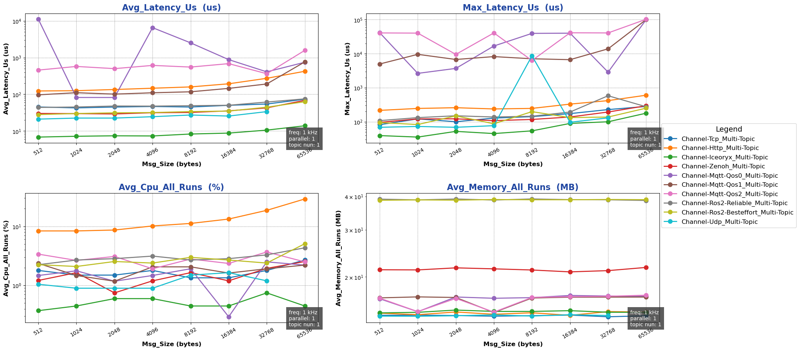

##### Impact of Topic Count in Multi-topic Mode:

- Purpose: Evaluate performance of single-machine cross-process Channel backend in multi-topic mode under different `topic counts`
- Configuration:
  - channel_frequency: 1 kHz
  - pkg_size: 1024 B
  - topic_number: 1 ~ 10
  - parallel_number=1
- Results:

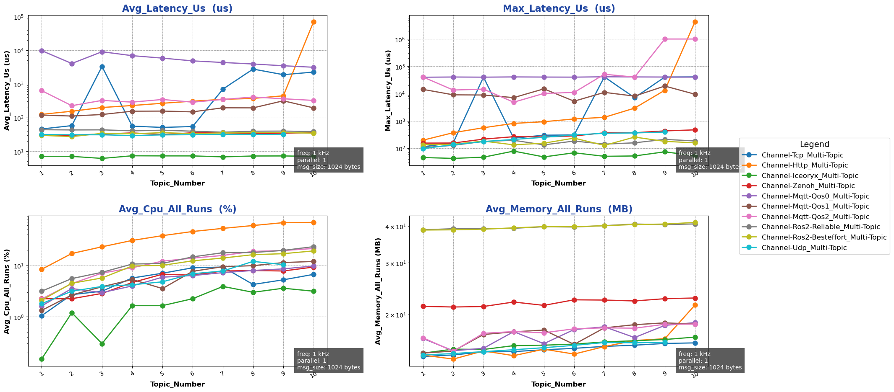

##### Impact of Packet Size in Parallel Mode:

- Purpose: Evaluate performance of single-machine cross-process Channel backend in parallel mode under different `packet sizes`
- Configuration:
  - channel_frequency: 1 kHz
  - pkg_size: 1024 B
  - topic_number: 1
  - parallel_number=1 ~ 10
- Results:

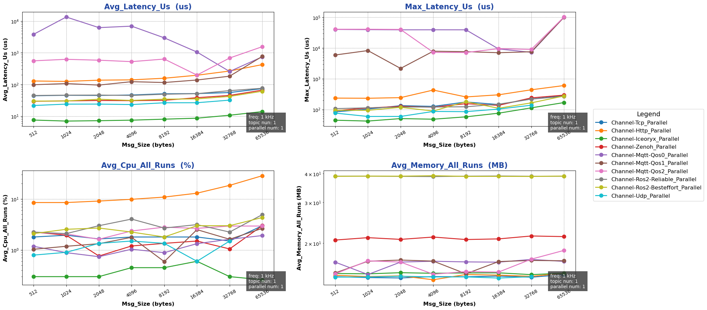

##### Impact of Concurrency in Parallel Mode:

- Purpose: Evaluate performance of single-machine cross-process Channel backend in parallel mode under different `concurrency levels`
- Configuration:
  - channel_frequency: 1 kHz
  - pkg_size: 1024 B
  - topic_number: 1
  - parallel_number=1 ~ 10
- Results:

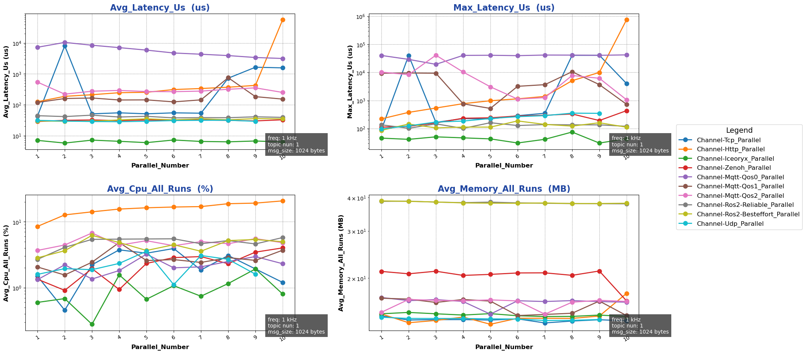

{{ '[Detailed Data]({}/document/sphinx-cn/tutorials/misc/performance_test/1.0.0/cpp/data/result_channel_local_cpp.csv)'.format(code_site_root_path_url) }}

#### Rpc Backend Performance Tests

##### Impact of Packet Size in Bench Mode:

- Purpose: Evaluate performance of single-machine cross-process Rpc backend in bench mode under different `packet sizes`
- Configuration:
  - mode: bench
  - channel_frequency: 1 kHz
  - pkg_size: 256 B ~ 64 KB (2^8 ~ 2^16, increasing by powers of 2)
  - paraller_number: 1
- Results:

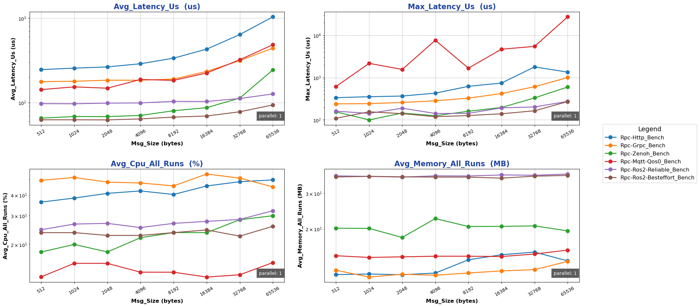

##### Impact of Concurrency in Bench Mode:

- Purpose: Evaluate performance of single-machine cross-process Rpc backend in bench mode under different `concurrency levels`
- Configuration:
  - mode: bench
  - channel_frequency: 1 kHz
  - pkg_size: 1024 B
  - paraller_number: 1 ~ 10
- Results:

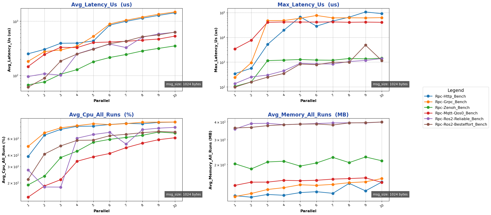

##### Impact of Packet Size in Fixed-freq Mode:

- Purpose: Evaluate performance of single-machine cross-process Rpc backend in fixed-freq mode under different `packet sizes`
- Configuration:
  - mode: fixed-freq
  - channel_frequency: 1 kHz
  - pkg_size: 256 B ~ 64 KB (2^8 ~ 2^16, increasing by powers of 2)
  - paraller_number: 1
- Results:

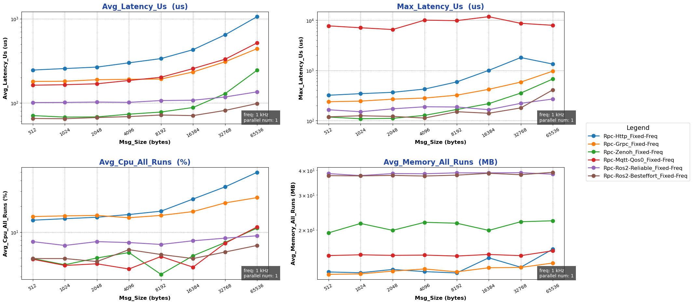

##### Impact of Concurrency in Fixed-freq Mode:

- Purpose: Evaluate performance of single-machine cross-process Rpc backend in fixed-freq mode under different `concurrency levels`
- Configuration:
  - mode: fixed-freq
  - channel_frequency: 1 kHz
  - pkg_size: 1024 B
  - paraller_number: 1 ~ 10
- Results:

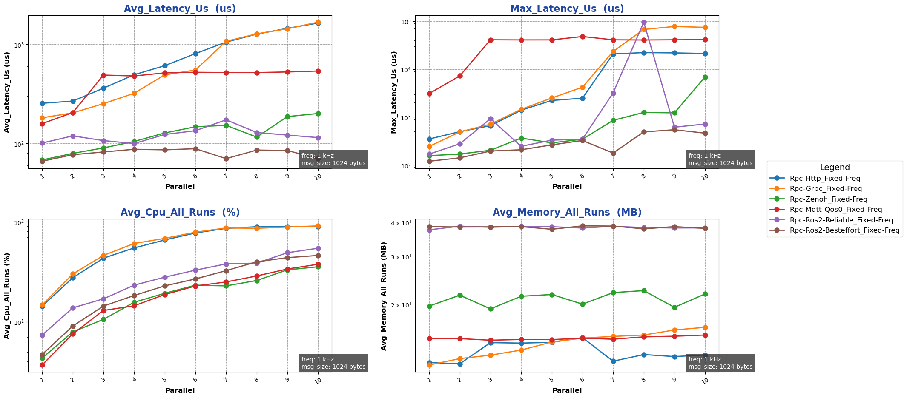

{{ '[Detailed Data]({}/document/sphinx-cn/tutorials/misc/performance_test/1.0.0/cpp/data/result_rpc_local_cpp.csv)'.format(code_site_root_path_url) }}

### Cross-machine Performance Test

#### Channel Backend Performance Tests

##### Impact of Packet Size in Multi-topic Mode:

- Purpose: Evaluate performance of single-machine cross-process Channel backend in multi-topic mode under different `packet sizes`
- Configuration:
  - channel_frequency: 1 kHz
  - pkg_size: 256 B ~ 64 KB (2^8 ~ 2^16, increasing by powers of 2)
  - topic_number: 1
  - parallel_number=1
- Results:

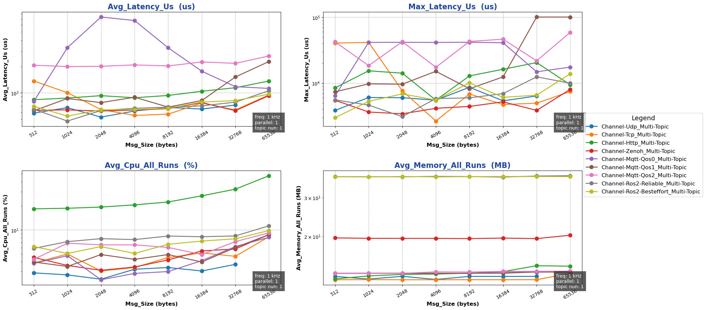

##### Impact of Topic Count in Multi-topic Mode:

- Purpose: Evaluate performance of single-machine cross-process Channel backend in multi-topic mode under different `topic counts`
- Configuration:
  - channel_frequency: 1 kHz
  - pkg_size: 1024 B
  - topic_number: 1 ~ 10
  - parallel_number=1
- Results:

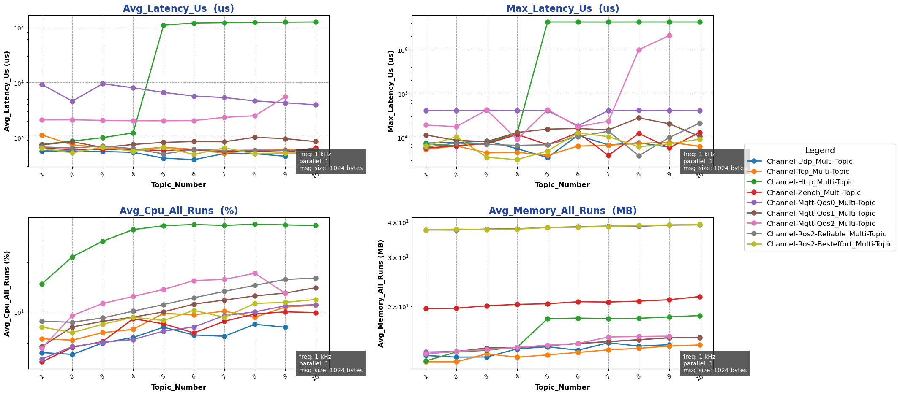

##### Impact of Packet Size in Parallel Mode:

- Purpose: Evaluate performance of single-machine cross-process Channel backend in parallel mode under different `packet sizes`
- Configuration:
  - channel_frequency: 1 kHz
  - pkg_size: 1024 B
  - topic_number: 1
  - parallel_number=1 ~ 10
- Results:

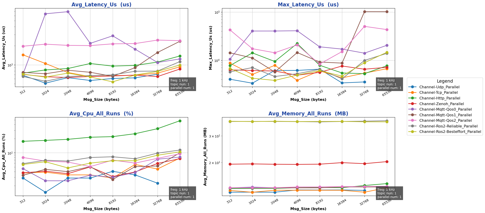

##### Impact of Concurrency in Parallel Mode:

- Purpose: Evaluate performance of single-machine cross-process Channel backend in parallel mode under different `concurrency levels`
- Configuration:
  - channel_frequency: 1 kHz
  - pkg_size: 1024 B
  - topic_number: 1
  - parallel_number=1 ~ 10
- Results:

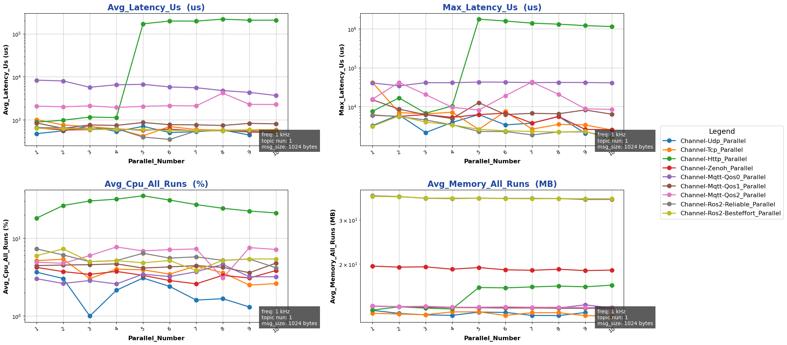

{{ '[Detailed Data]({}/document/sphinx-cn/tutorials/misc/performance_test/1.0.0/cpp/data/result_channel_cross_cpp.csv)'.format(code_site_root_path_url) }}

#### Rpc Backend Performance Tests

##### Impact of Packet Size in Bench Mode:

- Purpose: Evaluate performance of single-machine cross-process Rpc backend in bench mode under different `packet sizes`
- Configuration:
  - mode: bench
  - channel_frequency: 1 kHz
  - pkg_size: 256 B ~ 64 KB (2^8 ~ 2^16, increasing by powers of 2)
  - paraller_number: 1
- Results:

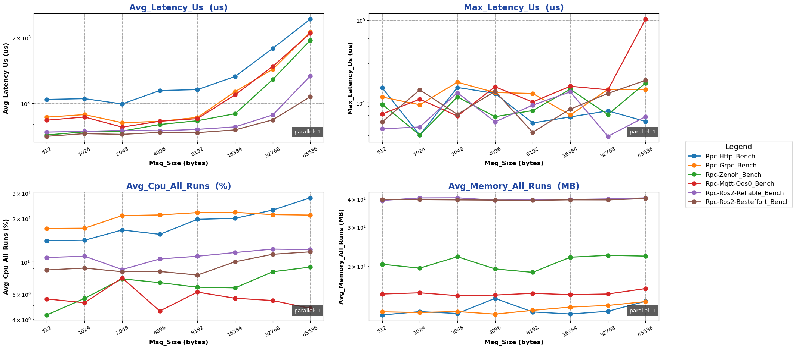

##### Impact of Concurrency in Bench Mode:

- Purpose: Evaluate performance of single-machine cross-process Rpc backend in bench mode under different `concurrency levels`
- Configuration:
  - mode: bench
  - channel_frequency: 1 kHz
  - pkg_size: 1024 B
  - paraller_number: 1 ~ 10
- Results:

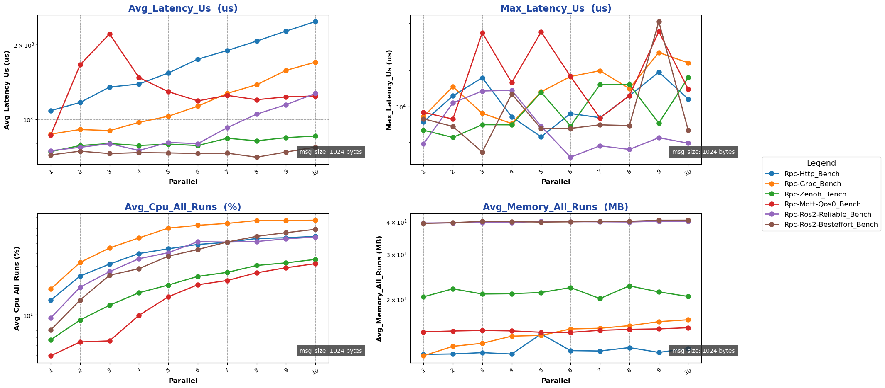

##### Impact of Packet Size in Fixed-freq Mode:

- Purpose: Evaluate performance of single-machine cross-process Rpc backend in fixed-freq mode under different `packet sizes`
- Configuration:
  - mode: fixed-freq
  - channel_frequency: 1 kHz
  - pkg_size: 256 B ~ 64 KB (2^8 ~ 2^16, increasing by powers of 2)
  - paraller_number: 1
- Results:

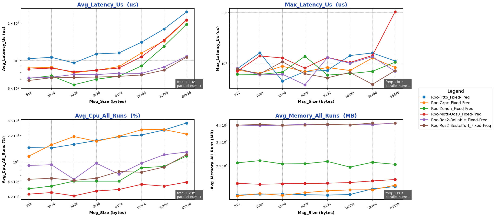

##### Impact of Concurrency in Fixed-freq Mode:

- Purpose: Evaluate performance of single-machine cross-process Rpc backend in fixed-freq mode under different `concurrency levels`
- Configuration:
  - mode: fixed-freq
  - channel_frequency: 1 kHz
  - pkg_size: 1024 B
  - paraller_number: 1 ~ 10
- Results:

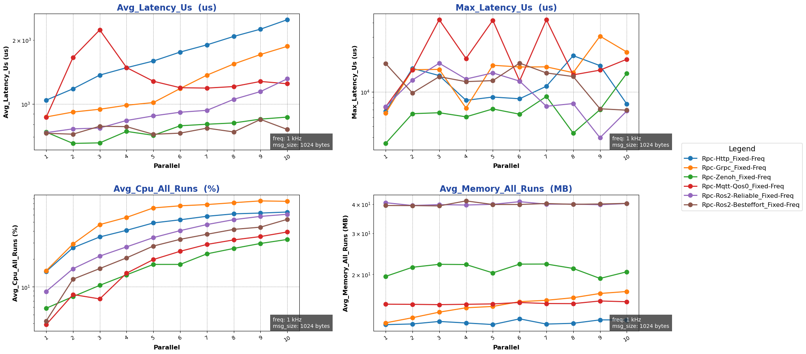

{{ '[Detailed Data]({}/document/sphinx-cn/tutorials/misc/performance_test/1.0.0/cpp/data/result_rpc_cross_cpp.csv)'.format(code_site_root_path_url) }}